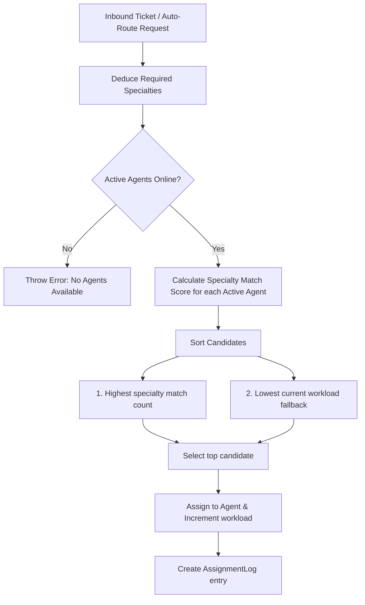

# Tool Architecture - Multi-Agent Assignment (Technical Deep Dive)

> **Note:** The authoritative architecture contract is in [`../ARCHITECTURE.md`](../ARCHITECTURE.md).
> This document provides technical details on data models, routing algorithms, and UI structure.

This document details the architectural decisions, data models, and logic workflows of the Multi-Agent Assignment tool.

## Technical Design Goals

- **Isolation**: The tool operates strictly as a self-contained module in `tools/v2/team/multi-agent-assignment/` with no dependencies on core database schemas, mail routing, or global state.
- **Predictable State Flow**: State is managed via a unidirectional flow through a custom React hook (`useMultiAgentAssignment`) communicating with an in-memory service factory (`createAssignmentService`).
- **Robust Auto-Routing**: A reliable routing algorithm maps inbound mail attributes to team specialties and workloads.

---

## 1. Domain Data Models

We define four primary interfaces in [types/index.ts](file:///home/henry/projects/open-source/stealth/tools/v2/team/multi-agent-assignment/types/index.ts):

### `Agent`

Represents a team member available to pick up tickets.

```typescript
interface Agent {
  id: string;
  name: string;
  role: string;
  email: string;
  status: "active" | "busy" | "offline";
  workload: number; // Active ticket count
  specialties: string[]; // Domain tags (e.g. "stellar", "security")
  avatar: string; // Emoji avatar
}
```

### `Thread`

Represents a conversation/email in the inbox queue.

```typescript
interface Thread {
  id: string;
  subject: string;
  snippet: string;
  sender: string;
  priority: "low" | "medium" | "high";
  assignedAgentIds: string[]; // Support for multi-agent assignments
  status: "unassigned" | "assigned" | "resolved";
  category?: string;
  date: string;
}
```

### `AssignmentLog`

Maintains an audit trail of actions performed within the workspace.

```typescript
interface AssignmentLog {
  id: string;
  threadId: string;
  threadSubject: string;
  agentId: string;
  agentName: string;
  action: "assigned" | "unassigned" | "auto-routed";
  timestamp: string;
  operator: string; // "Admin", "Auto-Routing Engine", or custom user name
}
```

---

## 2. Smart Routing Matcher Algorithm

The routing engine resides in `services/assignment.service.ts` and operates as follows:



### Specialty Deduction Rules

Required skills are deduced by scanning string tokens in the email's subject, body, and category tags:

- **stellar**: matches keywords like `stellar`, `blockchain`, `freighter`, `escrow`.
- **security**: matches keywords like `security`, `login`, `anomalous`, `hack`, `xss`.
- **billing**: matches keywords like `billing`, `invoice`, `discrepancy`, `finance`.
- **technical**: matches keywords like `api`, `gateway`, `technical`, `error`, `502`.
- **support**: matches keywords like `support`, `help`, `question`, `feedback`.
- If no terms match, it defaults to **general**.

### Score & Balancing Sort

Active candidates are sorted by:

```typescript
candidates.sort((a, b) => {
  // Sort by matching specialties count (descending)
  if (b.matchCount !== a.matchCount) {
    return b.matchCount - a.matchCount;
  }
  // Workload fallback: sort by current workload (ascending)
  return a.workload - b.workload;
});
```

---

## 3. UI Component Tree

```text
MultiAgentAssignmentDemo (demo.tsx)
 └── AssignmentConsole (components/AssignmentConsole.tsx)
      ├── Metrics Row (Metrics cards)
      ├── ThreadList (components/ThreadList.tsx)
      │    └── Dropdown selection of active agents
      ├── AgentList (components/AgentList.tsx)
      └── Simulator Controls (Inline forms & presets)
```

- **`AssignmentConsole`**: Orchestrates parent state and binds handler callbacks. Renders simulation banners, metrics, queue filters, and audit log elements.
- **`ThreadList`**: Handles searching, tab filters (all, unassigned, assigned, resolved), and interactive assignee modifications.
- **`AgentList`**: Renders team member cards, showing active workloads and interactive status updates.
